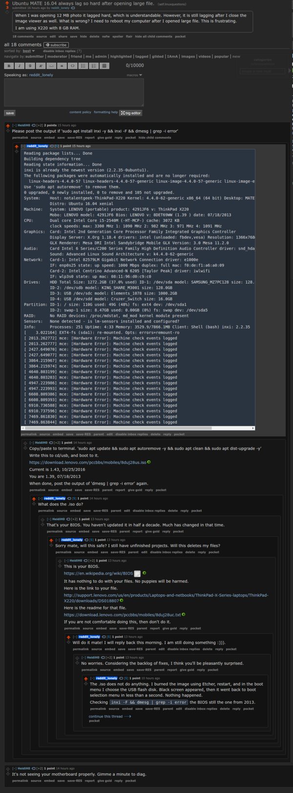

* How to update BIOS in Lenovo X220.
* My computer was running so slow under special circumstances (for example when opening folder with a lot of files or opening large binary blob).
* I asked a question on Reddit about this matter here, [https://www.reddit.com/r/linuxquestions/comments/5s2tkd/ubuntu_mate_1604_always_lag_so_hard_after_opening/](https://www.reddit.com/r/linuxquestions/comments/5s2tkd/ubuntu_mate_1604_always_lag_so_hard_after_opening/).

* u/HeidiH0 asked me to install `inxi`.
* So what is `inxi`? `inxi` is a full featured system information tools.
* I think `inxi` is like `screenfetch` but more into technical informations.
* Below is an example of `screenfetch` ran.

* Below is an example of `inxi -F && dmesg | grep -i error`.

* From `inxi` it is known that my BIOS has not been updated since half decade. That is probably why my computer ran slow.
* I downloaded the .iso file to update my BIOS here, [https://download.lenovo.com/pccbbs/mobiles/8duj28us.iso](https://download.lenovo.com/pccbbs/mobiles/8duj28us.iso).
* However, when I tried to use both Etcher and Disk (default ISO burner from Ubuntu) to make boot able USB flash drive it did not work.
* The .iso was simply not "attached" into the destined USB flash drive. The USB flash driver partition is detected as "unknown" in GParted.
* I was wondering why.
* The reason that I could think was either these.
    * The .iso file is defect.
    * Or my USB flash drive is broken.
* I tried to re - download the .iso but the result was still the same.
* Get different USB flash driver also did not solve the problem.
* Then I found the solution here, [https://workaround.org/article/updating-the-bios-on-lenovo-laptops-from-linux-using-a-usb-flash-stick/](https://workaround.org/article/updating-the-bios-on-lenovo-laptops-from-linux-using-a-usb-flash-stick/).
* Screenshot below.

* Apparently the `8duj28us.iso` is only made for Windows and I need to edit it a bit to make it work under Linux (honestly, I do not know why this is necessary).
* Anyway I need to install this, `sudo apt-get install genisoimage`. Then convert the `8duj28us.iso` into `bios.img` with `geteltorito -o bios.img 8duj28us.iso`.
* After that using either Etcher or Disk is enough to make a proper boot able USB flash drive.
* Then finally, I booted up into that USB flash drive and update my BIOS.