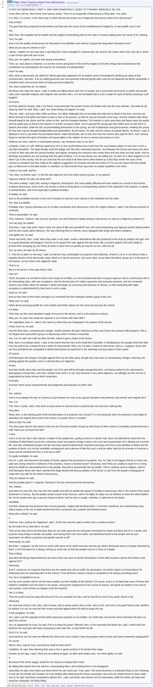
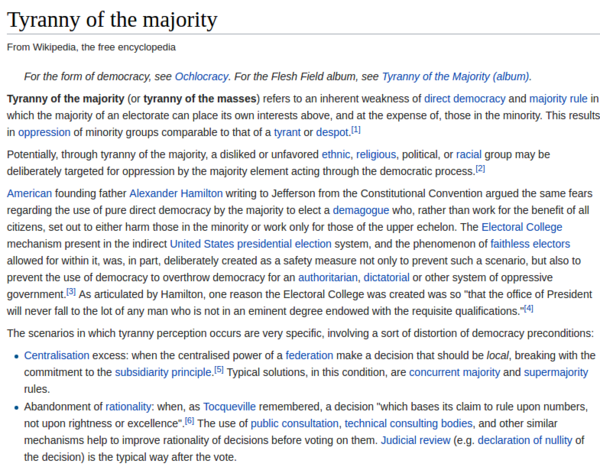

* There is this Reddit thread on how can tyranny raises from democratic.
* The answer is actually democratic creates the tyranny for majority.
* This excerpt in the Reddit thread is actually taken from Republic VIII: 562a-568a by Plato.
* Oligarchy is when a group of people control and manage organization.
* Tyranny is form of cruel and oppressive government.
* Here is the link to the Reddit thread, [https://www.reddit.com/r/philosophy/comments/5wahhg/plato_how_tyranny_arises_from_democracy/](https://www.reddit.com/r/philosophy/comments/5wahhg/plato_how_tyranny_arises_from_democracy/).
* Here is the link to the Wikipedia page, [https://en.wikipedia.org/wiki/Tyranny_of_the_majority](https://en.wikipedia.org/wiki/Tyranny_of_the_majority).
* Here is the screenshot of the Reddit thread.

* Here is the part screenshot of the Wikipedia article.

