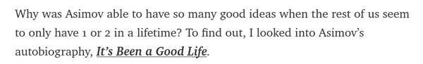

* I would like to read Isaac Asimov biography.
* It is titled "It's Been A Good Life".

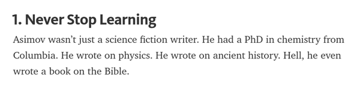

* Never stop learning.
* Learning should not stop when you are out of college.

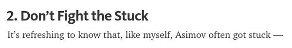

* Do not get stuck.
* If I get stressed out on doing something, be active search for other producitve thing to do.

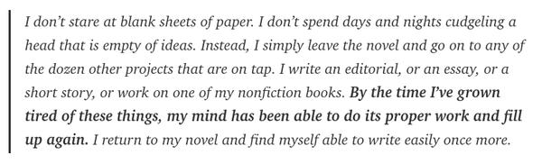

* Create simple other task that I can do if I am bored.
* This is the key actually. I can just call my family or friend.

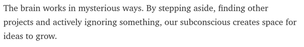

* Stepping aside from the main project and let brain magically something new and fresh for the main project.

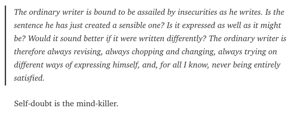

* There are always resistences comes internally and externally.
* Insecurity is bad.
* Self - doubt is a mind killer.

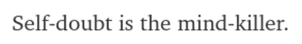

* This is the most important thing that really me.
    * Fear of rejection makes us "perfectionists". But that perfectionism just a shell (a fake one!). We draw into it when times are hard. It gives us safety, however, a fake safety. 

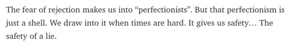

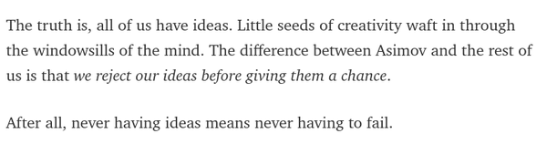

* Do not reject idea before giving them chance.
* Never having ideas means never having to fail.

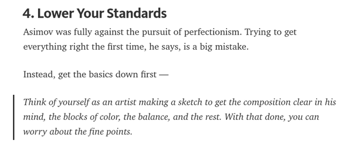

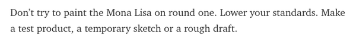

* Lower your standard.
* Start by making prototypes over prototypes.
* You would not start painting Monalisa at your first try.
* Make a lot of these.
    * Drafts.
    * Prototypes.
    * Tests.

* Anime style, "believe in your creations".

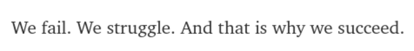

* We fail, we struggle, and that is why we succeed.

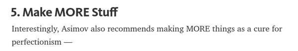

* Make tons of more stuffs!
* He said that this is the cure of perfectionism.

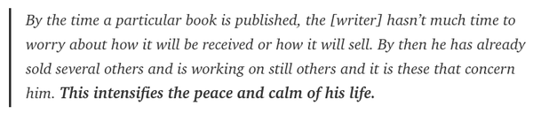

* Keep working on other things.
* This intensifies the peace and calm his life.

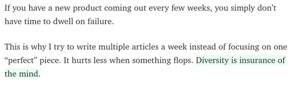

* If you keep making new things/products you simply would not care to dwell on failure.
* Make a lot of things instead of making one thing perfect.
* Diversity is insurance of the mind.

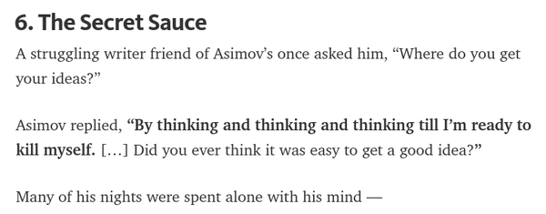

* How to get idea, according to Isaac Asimov is to thinking and thinking into until you are ready to kill yourself (lololo).
* He said this because it is not easy to get into the good/best idea.

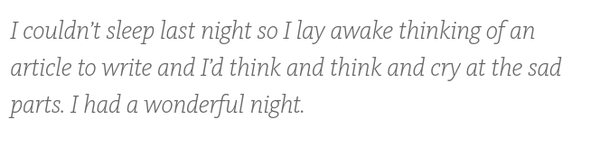

* Link to this article, [https://medium.com/personal-growth/isaac-asimov-how-to-never-run-out-of-ideas-again-b7bf8e09cc91](https://medium.com/personal-growth/isaac-asimov-how-to-never-run-out-of-ideas-again-b7bf8e09cc91).
* This is screenshot of the article.

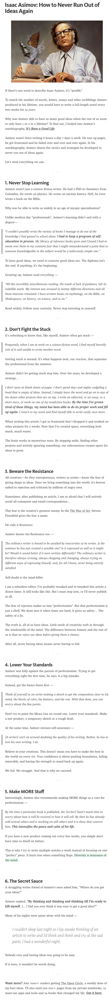