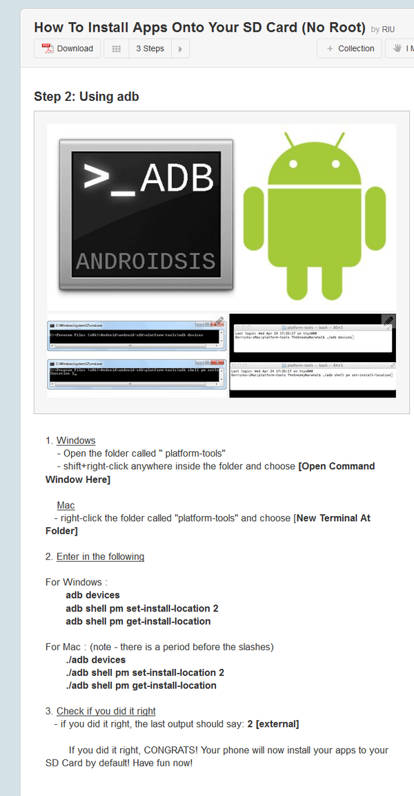

* I found this tutorial here, [http://www.instructables.com/id/How-to-install-apps-onto-your-SD-Card-No-Root/](http://www.instructables.com/id/How-to-install-apps-onto-your-SD-Card-No-Root/), it is about installing application directly into SD Card in un - rooted Android phone.
* I think this is was before I got decent Android phone.
* Here is the screenshot of the tutorial. 

