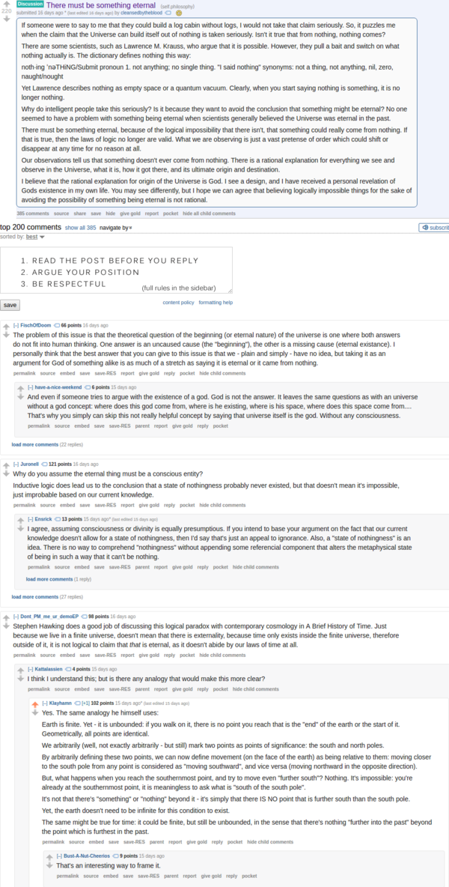
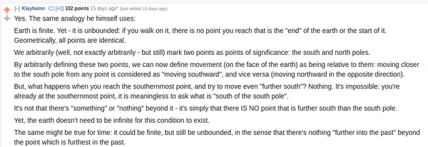

* "There is should be something that is eternal" discussion in Reddit, [https://www.reddit.com/r/philosophy/comments/5w2rva/there_must_be_something_eternal/](https://www.reddit.com/r/philosophy/comments/5w2rva/there_must_be_something_eternal/).
* Interesting topic and what he/she explained is make sense to me.
* Screenshot.

* There is a nice rebuttal also in this thread.
* The main idea in this rebuttal is that there is a point that does not make sense to go even further.
* The idea is infinte is looped but not bounded.
* Simplest idea is when you walk yourself on Earth to the North, you can keep walking indefinitely, hence infinite.
* But the bound then determined, the North and South pole. With introduction of these going even further to North is meaningless if you are already in North Pole.
* Hence, time maybe infinite, but there should be determinable bounds that makes time meaningless if you go through it.

