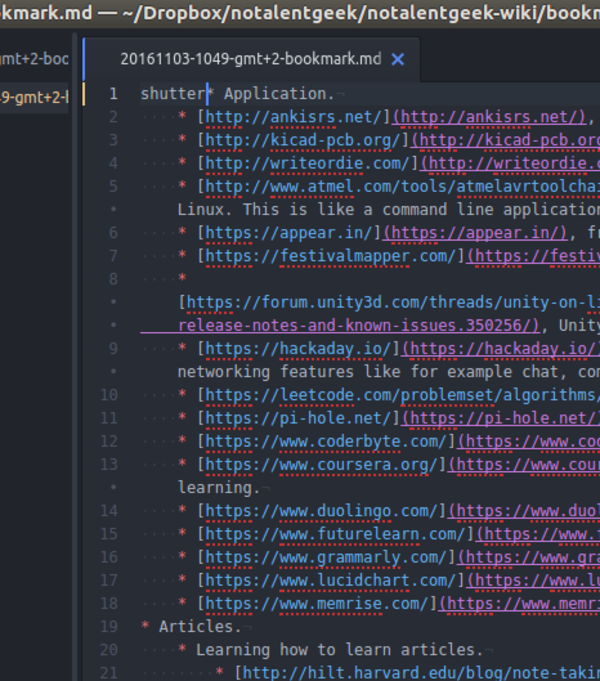
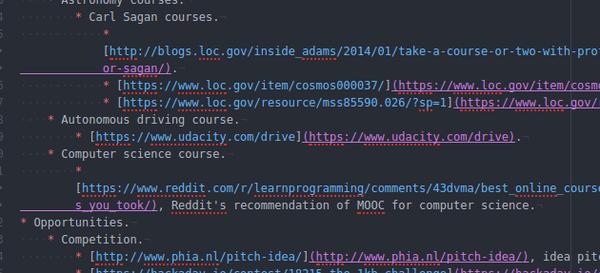
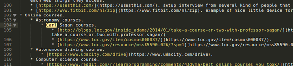
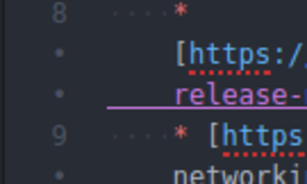

* Atom complain.
* I want to make a suggestion for Atom text editor.
* It is an editor made with web technology, it has a lot of plug - ins, but so bloated.
* In my case it has the same boot time with Microsoft VisualStudio.
* So, my problem with Atom is that when I am creating a MarkDown file,it display like this.

* Look at the trailing link line. In more larger file it makes the .md file not easy to read.
* Here is an example.

* SublimeText offers cleaner approach to MarkDown file.

* Suggestion post.

Hello, I have a lot of notes in MarkDown format. I use SublimeText, but recently I wanted to give Atom a try.

I have a complaint about how Atom displays .md file. Especially when writing a link, then word - wrapped into another line, there is a trailing line below the link. For one or two these are okay, but for more than that it is become harder to read.

Here is what I meant.

I am not sure if this is intended. If so, I would like to know why it is like this in Atom.

In my opinion, SublimeText offers cleaner visualization than what Atom has now for MarkDown.

