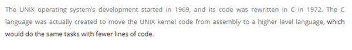

* The UNIX, the basic operating system started its development in 1969.
* UNIX was coded in Assembly programming language.
* However, the code was re - written in 1972 with C programming language.
* The idea was because programming in C takes fewer amount of codes than programming in Assembly for achieving the same result.

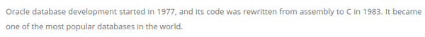

* The same thing happened with Oracle Database.
* The Oracle Database is one of the most popular database in the world.
* It was written in Assembly programming language.
* However, later in 1983, Oracle Database was re - written in C as well.

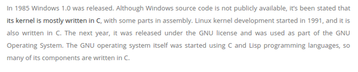

* In 1985 Windows 1.0 was released.
* Windows 1.0 kernel was mostly coded in C.
* However, there are some parts from Windows 1.0 that is still written in Assembly.
* Linux kernel development started in 1991.
* So, this information means that Linux is actually younger than Windows.
* The Linux project is younger than Windows.
    * Linux started in 1991.
    * Windows started in 1985.
* Linux, the GNU operating system, was started using C and LISP programming language.
* Many of Linux components are written in C.

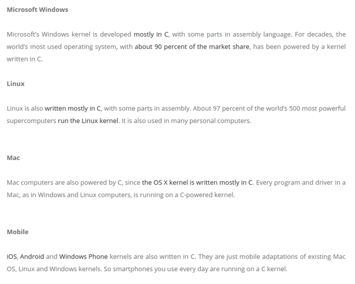

* All mainstream operating system has its codes written in C.
    * Windows was made with Assembly and C programming  languages.
    * Linux was made with Assembly and C programming languages.
    * Mac OS was made with C.
    * Android, iOS, Windows Mobile operating system is written in C.

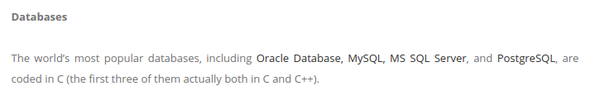

* Most of world's famous databases was also written in C.
    * Microsoft SQL Server.
    * MySQL.
    * Oracle Database.
    * PostgreSQL.
* The other kind of database, the NOSQL variants like MongoDB are written in combination with C, C++, and JavaScript.
* I think the JavaScript part was used to make easier interface with NodeJS.

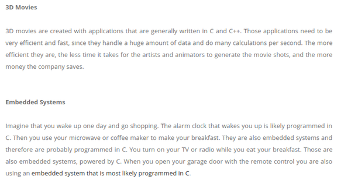

* It is says here in this article as well that 3D movies are also mainly made with C programming language as well.
* In C and C++ to be precise.
* I am not sure if the "3D" here meant as it is 3D stereoscopic images that can be seen only with those 3D glasses. Or 3D as it is in computer generated movies.
* I think the "3D" here is more toward the latter, since this paragraph mentions about animators.
* It says here, that 3D needs doing many calculations, handling big data, and precise calculations. And these are the main reasons why C is used instead of other programming language.
* Embedded system also most of the time coded in C.
* This is because embedded system has limited amount of storage.
* And C is used, because C programming language is deterministic about the memory allocation and management.

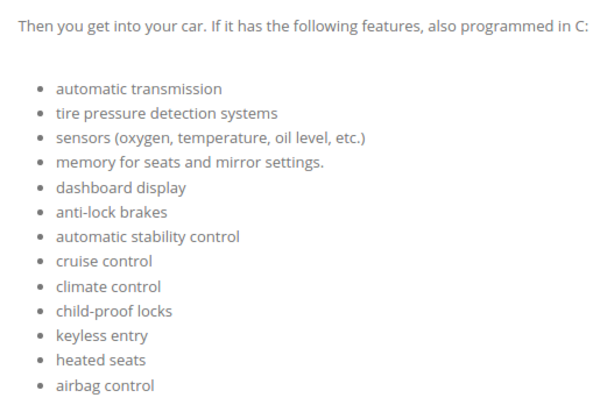

* There are these example of automotive embedded applications those are coded in C programming language.
    * Airbag control.
    * Anti - lock brakes.
    * Automatic stability control.
    * Automatic transmission.
    * Child proof lock.
    * Climate control.
    * Cruise control.
    * Dashboard display.
    * Heated seats.
    * Keyless entry.
    * Memory for seats and mirror settings.
    * Sensors.
    * Tire pressure detection system.

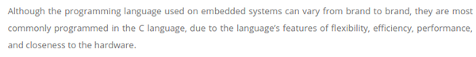

* Although the programming languages used are different between brands.
* The common back - end programming language used is still C.
* C offers these.
    * Closeness to hardware while maintaining readability and efficient syntax.
    * Efficiency.
    * Flexibility.
    * Performance.

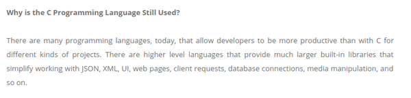

* The C programming language is still used because C allows developers to be productive with C for any kind of project.
* The point above means that C has the portability.
* C has higher level language that provide much larger built - in libraries that simplify working with these.
    * Client request.
    * Database connection.
    * JSON.
    * Media manipulation.
    * UI.
    * Web pages.
    * XML.
    * ....

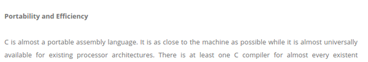

* 2 things those made C to be a definite choice are portability and efficiency.
* C is closer to any machine language than any programming language beside the Assembly programming language itself.
* C compiler can target almost all processor architecture.

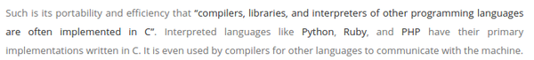

* With this reason, some of higher level programming languages have their compilers, library, and interpreter coded in C programming language.
* For example.
    * Python.
    * Ruby.
    * PHP.
* The examples above has their tools coded in C.
* C was used to coded compilers because its closeness to machine language.

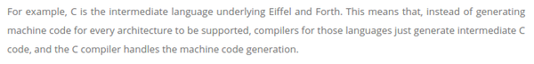

* Another example would be C is used as an intermediate compiler between programming languages named Eiffel and Forth.
* C compiler offers another layer of interface for programming language instead of direct interpretation to machine language.
* So these languages, have their codes interpreted into C codes that then access machine level operation.

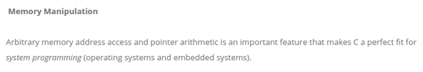

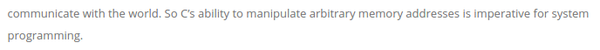

* C is very "state of the art" programming language.
* C has a manual memory manipulation like no other programming languages have (perhaps C++, but it is still C variant).
* C ability to address memory access and pointers is an important features for the development of system programming.

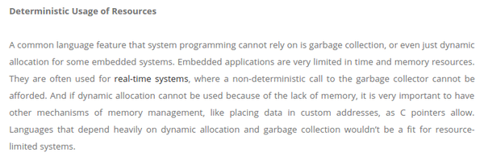

* There is this section about deterministic usage of resources.
* This section is about a common programming language compiler/interpreter that rely heavily on its automatic garbage collection.
* However, for embedded system with low memory spaces, garbage collection sometimes takes some unnecessary memory spaces.
* Sometimes, due to the limited, memory garbage collection and automatic memory allocation could not be called.
* Programming languages those depend on automatic memory allocation and garbage collection would not be fit in resource limited systems.
* This is where C can still be used.
* So, when efficiency is a must, I should use C.

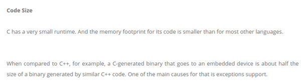

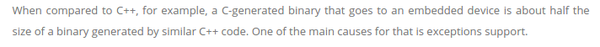

* And for the code size C has twice smaller codes when compared to C++.
* The binary generated is twice as smaller as those generated from C++.
* The main cause is due to its exception support.

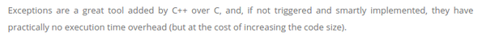

* Exceptions are great tools added into C++ that is not exists in C.

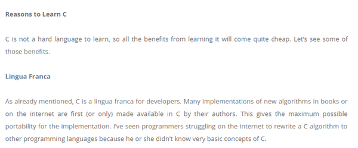

* Reasons to learn C.
    * C is not a hard programming language.
    * C is a lingua franca programming language.
    * C is portable.
* Learning C benefit your further learning in programming language.
* If you know codes in C you could easily implemented that codes into other programming languages.

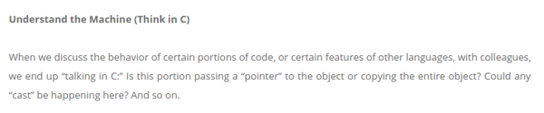

* "Understand C, understand machine!".

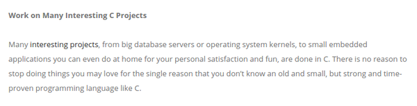

* There are many projects those are coded in C.

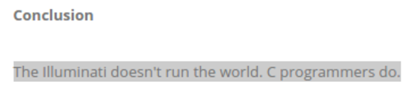

* "The Illuminati does not run the world, C programmers do.".

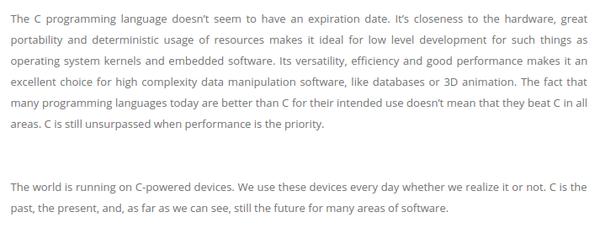

* C programming language does not seems to have an expiration date.
* I think this is because its closeness to hardware while maintaining human readable syntaxes.
* A programmer can write anything possible in C.
* There are many specifics programming languages for specific needs. However, most of the time C can cover it (unless client web application programming).
* The world is still running in C powered devices.
* Here is the link to the article, [http://tekhinnovation.blogspot.nl/2017/03/after-all-these-years-world-is-still.html](http://tekhinnovation.blogspot.nl/2017/03/after-all-these-years-world-is-still.html).
* Here is the full screenshot of the article.

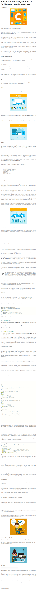