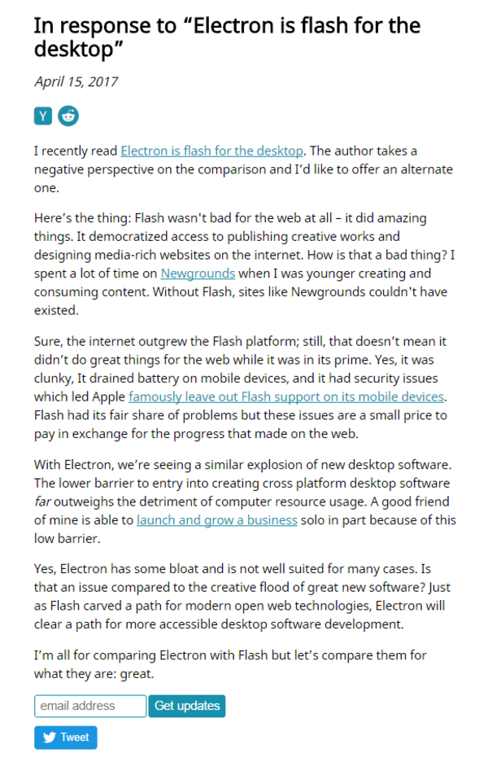

* I found this article from Reddit, [https://josephg.com/blog/electron-is-flash-for-the-desktop/](https://josephg.com/blog/electron-is-flash-for-the-desktop/).
* This article is about how bad Electron is to make desktop application.
* I am happy that I am not the only one who thinks like this.
* Screenshot of the article.

* There is this counter response from this article as well, [https://rempel.world/posts/electron.html](https://rempel.world/posts/electron.html).
* However, from the Reddit thread, it seems that a lot of people does not like the counter point made in this article.
* Screenshot.

