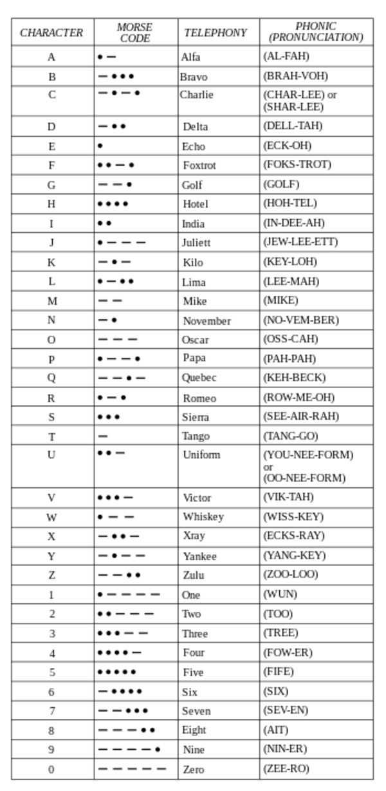

* Here is NATO official phonetic alphabet. I should to remember this in case I go talk with customer support with weird accent.

* Here is te link to the Wikipedia entry, [https://en.wikipedia.org/wiki/NATO_phonetic_alphabet](https://en.wikipedia.org/wiki/NATO_phonetic_alphabet).