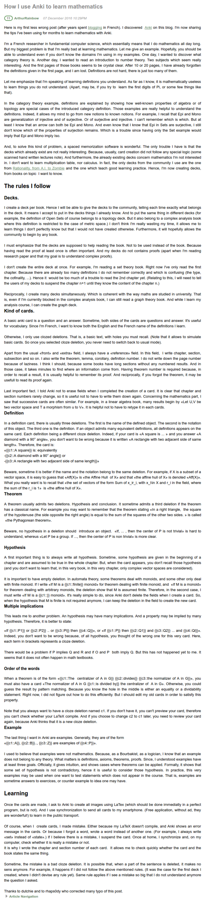

* Here is an article about how to learn mathematics using Anki, [http://lesswrong.com/r/discussion/lw/o8e/how_i_use_anki_to_learn_mathematics/](http://lesswrong.com/r/discussion/lw/o8e/how_i_use_anki_to_learn_mathematics/).
* Anki is a flash card open source application.
* Here is a full screenshot of the article.

