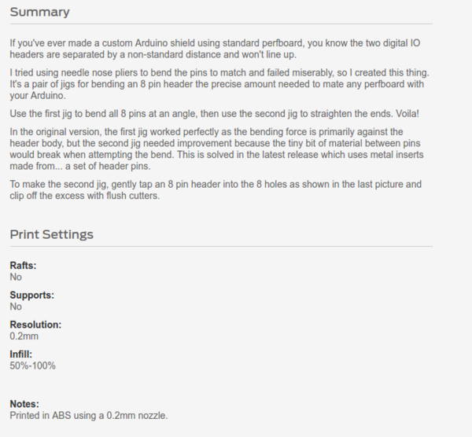
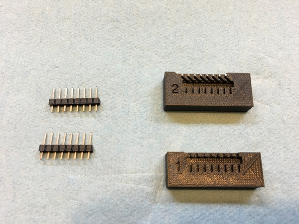
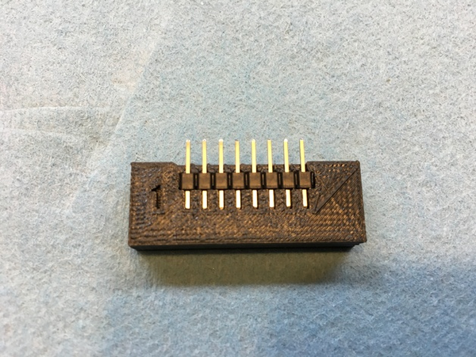
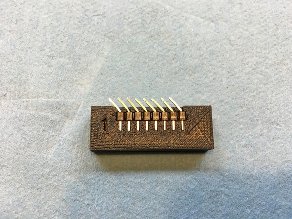
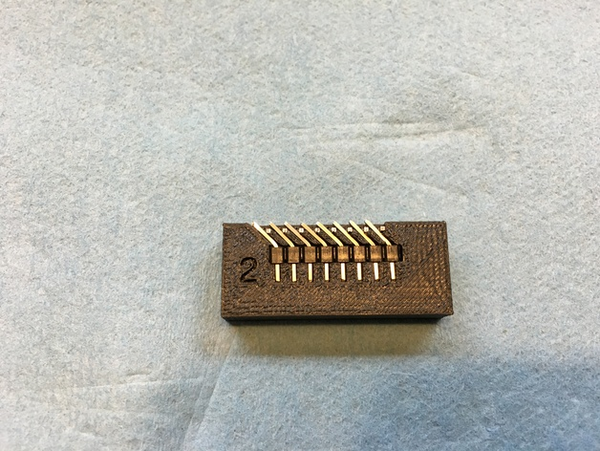
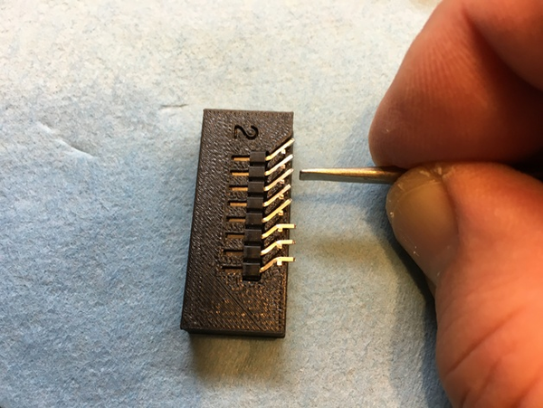
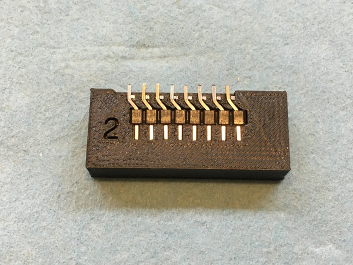

* DIY Arduino shield pin bender, [http://hackaday.com/2016/12/13/make-your-own-arduino-header-pins/](http://hackaday.com/2016/12/13/make-your-own-arduino-header-pins/).
* Thingiverse page, [http://www.thingiverse.com/thing:1920037](http://www.thingiverse.com/thing:1920037).
* Here are specification from the Thingiverse page.

* Here is the step by steps on how to use the pin bender.

* Here is the 3D printing document for the pins bender.

[./20161214-1331-cet-arduino-shield-offset-header-8.zip](./20161214-1331-cet-arduino-shield-offset-header-8.zip)