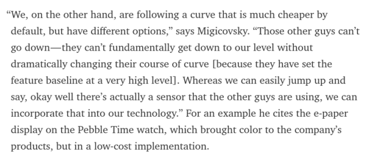

* Pebble shows us on how to manage competition with other smart watch like Android Watch or Apple Watch.
* The main idea is to create a flexible platform that can be low as possible (the barebone minimum) and can also be build as magnificent as the developers want.
* For example in this case Android Watch and Apple Watch comes a lot of features. These features will make their device hard to be scaled down. While in the other hand Pebble watch that start from the barebone minimum can easily adjust features of the smart watch and then the price.
* Pretty clever explanation in my opinion.

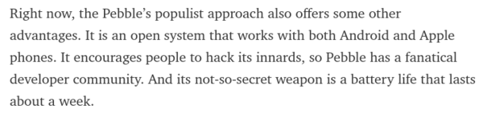

* Pebble is an open system that is not tied to either Android or Apple.
* It can be used within both environment quite well.

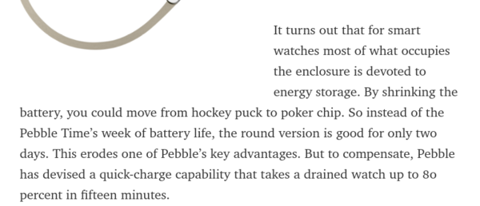

* When you take some features (in this example Pebble reduced the battery life) you need to make sure you give additional or more features.
* When the new Pebble created with reduced battery life than the previous Pebbles, the developers decided to add super charging feature that let the watch can be charged to 80% within 15 minutes.

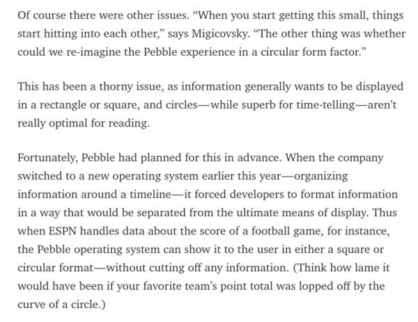

* From this excerpt above, we can learn from Pebble that when making an operating system the user interface need to be regulated.
* Especially in limited display like in Pebble watch.
* In this scenario Pebble need to adjust by giving new guidelines for its developers to create interface of their Pebble watch application.
* Here is the link to the article, [https://backchannel.com/pebble-is-trying-to-run-circles-around-apple-a87d96590d3](https://backchannel.com/pebble-is-trying-to-run-circles-around-apple-a87d96590d3).
* Below is the full screenshot.

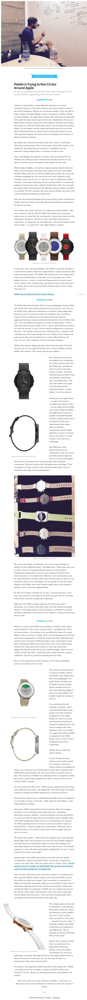

* From this link, , another article about Pebble.

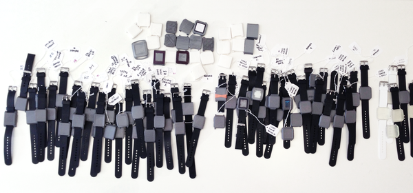

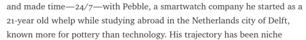

* From the link, it is known that the creator of Pebble was once studying in Deflt.

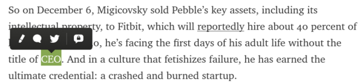

* He started his business when he was 21 years old.
* Went to Y Combinator.
* Create Pebble.
* And now he is 30 starting his adulthood first time without the title of CEO.
* Pebble was a lone hardware startup.
* First it was in a company named Alerta with a product named InPulse (also a smart watch).
* Below is the predecessor of Pebble. The InPulse smart watch that usually paired with BlackBerry.

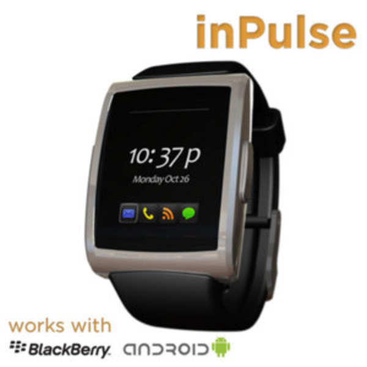

* The chronological order of the down of the Pebble.
* It just started on 2015 when it has no profit.
* So, lesson learned from this is that if you are not making profit for a year probably you will have your company closed by next year.

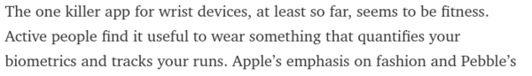

* Both Apple and Pebble misjudge the smart watch market.
* The only thing that people uses with smart watch is the fitness tracking application.
* And neither of their smart watches have emphasize on this.

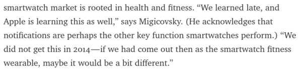

* His only regret on Pebble is that the smart watch did not come as a fitness tracker.
* Apple also has this regret.

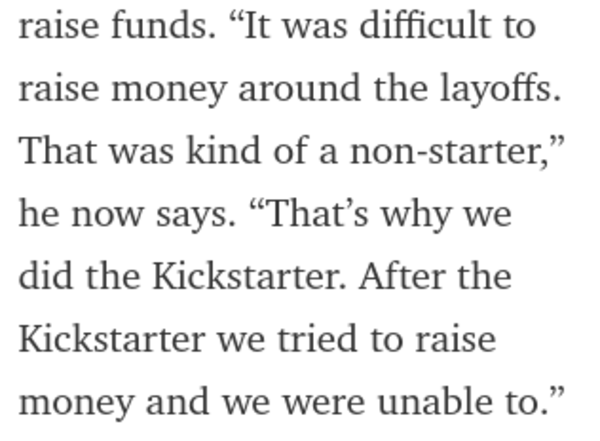

* Pebble was failed to raise money to develop their new line of smart watch application.
* There are Pebble Time 2 and Pebble Core along this line of those they did not have money to develop.
* The solution? Kickstarter!

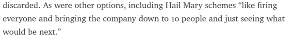

* The hail marry schemes.
* Usually happen in small startup company.
* This is to release employees up to the smallest amount possible (like 10 or so).
* So, when I am going to work in s startup I must consider this.

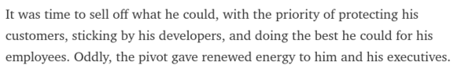

* When your company sunk, create some prioritizes on what to protect.
* For example in Pebble case. The CEO prioritizes these.
    * Developers.
    * His loyal employees.
    * The loyal customers.
* Pebble choose to be bought by fitBit because they promise Pebble to keep some of their customers and the developers.

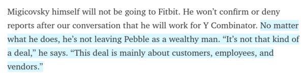

* Migicovsky left people not as a wealthy man.
* Link to the article, [https://backchannel.com/the-real-story-behind-pebbles-demise-303802a7afaa](https://backchannel.com/the-real-story-behind-pebbles-demise-303802a7afaa).
* Full screenshot of the article.

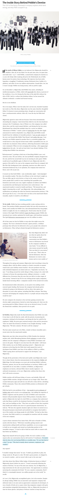