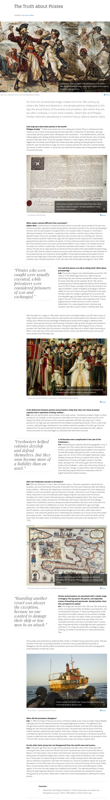

* There is this article that what pirate is/was about, [https://news.cnrs.fr/articles/the-truth-about-pirates](https://news.cnrs.fr/articles/the-truth-about-pirates).
* There are 3 concepts that put my eyes on.
    * Pirate is what the stereotypical pirate all about, robbing ship, and so on.
    * Privateer is pirates those are employed by the government. I think this is like Shicibukai from One Piece. The government was also willing to lend some military vessels for people without boat who wants be a privateer.
    * Freebooter is actually privateer that goes beyond their permitted area of operation and behave more like a pirate.
* During wars in the past, some western European countries decided that they need to manage pirates in their territory, hence they created privateer.
* Modern pirates in Somalia are exists because of poverty.
* Here is the full screenshot of the article.

