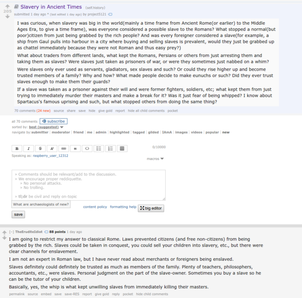

* Reddit threat about slavery in ancient times, [https://www.reddit.com/r/history/comments/5m43po/slavery_in_ancient_times/](https://www.reddit.com/r/history/comments/5m43po/slavery_in_ancient_times/).
* In old times, slavery is not always about people who do the hard job.
* In fact, in old Rome, slave can also be a philosopher.
* Slave can also be someone who is loyal to a family.
* In old Rome, you can "sell" your child as a slave. There was a regulation for it.
* In fact, slavery is regulated, so that people could not just be grabbed by the rich.
* Full screenshot of the article.

