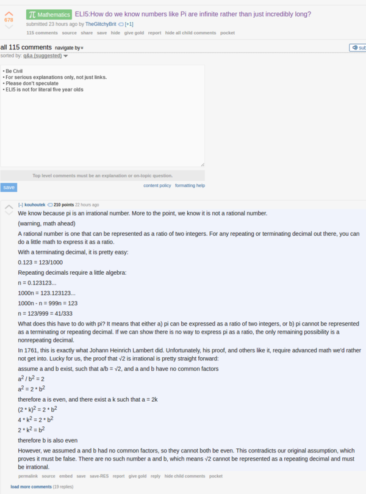

* There is this Reddit thread that explains on why number pi (3.14...) have infinite amount of trailling number behind comma.
* Here is the link to the thread, [https://www.reddit.com/r/explainlikeimfive/comments/5w4fv8/eli5how_do_we_know_numbers_like_pi_are_infinite/](https://www.reddit.com/r/explainlikeimfive/comments/5w4fv8/eli5how_do_we_know_numbers_like_pi_are_infinite/).
* Screenshot.

