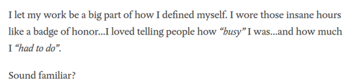
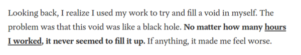
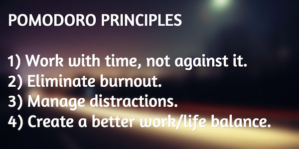
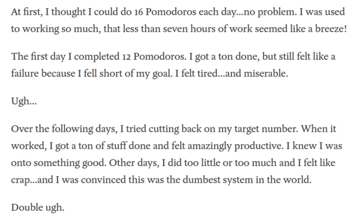
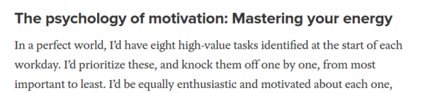
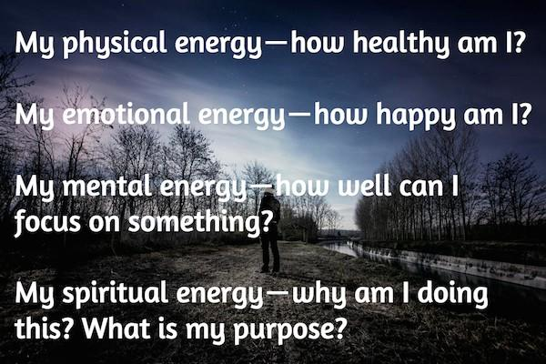
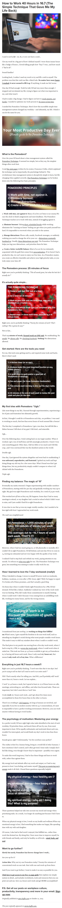

* There is this article that gives tips on how to work 40 hours (per week I think?).
* I got this article from my Reddit thread here, [https://www.reddit.com/r/productivity/comments/5x1rfk/how_can_i_just_work_uninterrupted_all_the_time/](https://www.reddit.com/r/productivity/comments/5x1rfk/how_can_i_just_work_uninterrupted_all_the_time/).
* For my Reddit thread itself there are some tips that is "make sense" to me.
    * Make sure to have full screen when doing something with computer. More spaces those are not relevant to what I am currently doing mean more distraction.
    * When doing Pomodoro break please walk away from the desk.
* This is the article itself, [https://getpocket.com/explore/item/how-to-work-40-hours-in-16-7-the-simple-technique-that-gave-me-my-life-back-1291711976](https://getpocket.com/explore/item/how-to-work-40-hours-in-16-7-the-simple-technique-that-gave-me-my-life-back-1291711976).
* Yep, this is me!!!!

* Yep, this is me again!!!!

* The Pomodoro principles.

* The key point is work with the time and not go against it.
* This is me again!!!!

* Knock the most important task first.

* Kind of energies. If I feel like to not doing a task then there is one of these energies missing.
* I need to find which kind of energy is lacking and then satisfy the needs.

* To sum up.
    * Emotional energy.
    * Mental energy.
    * Physical energy.
    * Spiritual energy.
* This is screenshot for the whole article.

* Screenshot of my Reddit thread.

