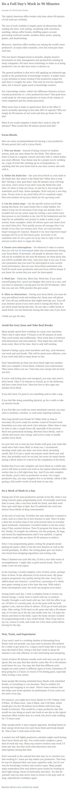

* Tips on working fast and efficient in Pomodoro.
	* Pick one theme.
	* Define a fail - able finish line.
	* List the actions and steps. As accurate as possible.
	* Ensure zero interruption.
	* Work as fast as possible.
	* Allow no distraction at all.
* Another point for me is to always have the result ready to be presented.
* So when making something, make sure that at any given second you are ready to present what you are making to other people.
* Here is the link to the article, [https://www.stevepavlina.com/blog/2014/12/do-a-full-days-work-in-90-minutes/](https://www.stevepavlina.com/blog/2014/12/do-a-full-days-work-in-90-minutes/).
* Here is the screenshot to the article.

