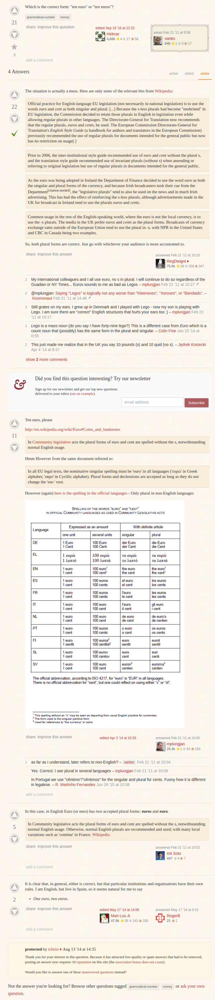

* I got the answer from this discussion on language StackExchange, [http://english.stackexchange.com/questions/13551/%E2%82%AC10-ten-euro-or-ten-euros](http://english.stackexchange.com/questions/13551/%E2%82%AC10-ten-euro-or-ten-euros).
* Basically both "ten Euro" and "ten Euro" are correct.
* Here is the full screenshot.

