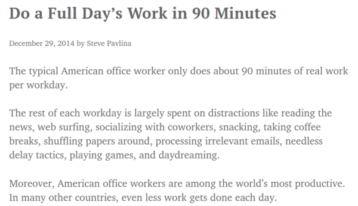
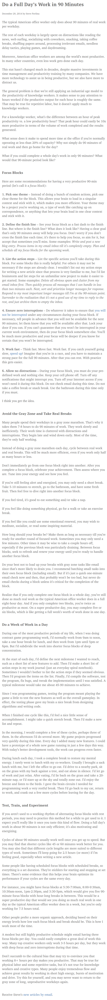

* I read this somewhere that most American can actually squeeze their daily work hours into 90 minutes full session of working.
* Here is the article, [https://www.stevepavlina.com/blog/2014/12/do-a-full-days-work-in-90-minutes/](https://www.stevepavlina.com/blog/2014/12/do-a-full-days-work-in-90-minutes/).
* Here is the screenshot.

