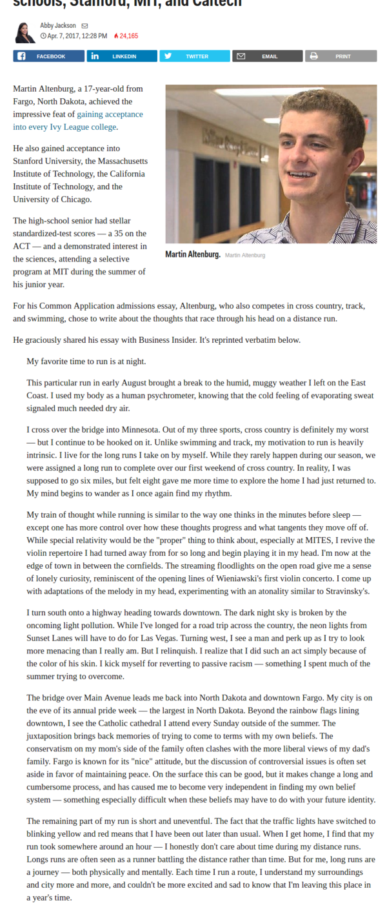

* There is this article about 17 years old who got accepted into all Ivy League universities.
* Here is the link to the article, [http://www.businessinsider.com/admissions-essay-all-ivy-league-schools-2017-4?international=true&r=US&IR=T](http://www.businessinsider.com/admissions-essay-all-ivy-league-schools-2017-4?international=true&r=US&IR=T).
* Here is his motivation letter.

My favorite time to run is at night.

This particular run in early August brought a break to the humid, muggy weather I left on the East Coast. I used my body as a human psychrometer, knowing that the cold feeling of evaporating sweat signaled much needed dry air.

I cross over the bridge into Minnesota. Out of my three sports, cross country is definitely my worst — but I continue to be hooked on it. Unlike swimming and track, my motivation to run is heavily intrinsic. I live for the long runs I take on by myself. While they rarely happen during our season, we were assigned a long run to complete over our first weekend of cross country. In reality, I was supposed to go six miles, but felt eight gave me more time to explore the home I had just returned to. My mind begins to wander as I once again find my rhythm.

My train of thought while running is similar to the way one thinks in the minutes before sleep — except one has more control over how these thoughts progress and what tangents they move off of. While special relativity would be the "proper" thing to think about, especially at MITES, I revive the violin repertoire I had turned away from for so long and begin playing it in my head. I'm now at the edge of town in between the cornfields. The streaming floodlights on the open road give me a sense of lonely curiosity, reminiscent of the opening lines of Wieniawski's first violin concerto. I come up with adaptations of the melody in my head, experimenting with an atonality similar to Stravinsky's.

I turn south onto a highway heading towards downtown. The dark night sky is broken by the oncoming light pollution. While I've longed for a road trip across the country, the neon lights from Sunset Lanes will have to do for Las Vegas. Turning west, I see a man and perk up as I try to look more menacing than I really am. But I relinquish. I realize that I did such an act simply because of the color of his skin. I kick myself for reverting to passive racism — something I spent much of the summer trying to overcome.

The bridge over Main Avenue leads me back into North Dakota and downtown Fargo. My city is on the eve of its annual pride week — the largest in North Dakota. Beyond the rainbow flags lining downtown, I see the Catholic cathedral I attend every Sunday outside of the summer. The juxtaposition brings back memories of trying to come to terms with my own beliefs. The conservatism on my mom's side of the family often clashes with the more liberal views of my dad's family. Fargo is known for its "nice" attitude, but the discussion of controversial issues is often set aside in favor of maintaining peace. On the surface this can be good, but it makes change a long and cumbersome process, and has caused me to become very independent in finding my own belief system — something especially difficult when these beliefs may have to do with your future identity.

The remaining part of my run is short and uneventful. The fact that the traffic lights have switched to blinking yellow and red means that I have been out later than usual. When I get home, I find that my run took somewhere around an hour — I honestly don't care about time during my distance runs. Longs runs are often seen as a runner battling the distance rather than time. But for me, long runs are a journey — both physically and mentally. Each time I run a route, I understand my surroundings and city more and more, and couldn't be more excited and sad to know that I'm leaving this place in a year's time.

* It is actually amazing to have motivation letter to be like this, instead the traditional motivation letter.
* Next time I made a motivation letter it needs to be more personal.
* Aside from those all Ivy League universities, he also got accepted into these universities.
    * California Institute Of Technology.
    * Massachusetts Institute Of Technology.
    * Stanford University.
    * University Of Chicago.
* Shit he is like 6 years old younger than me, but I am way outside his league. What to do :D????
* Here is the screenshot of the whole article.

