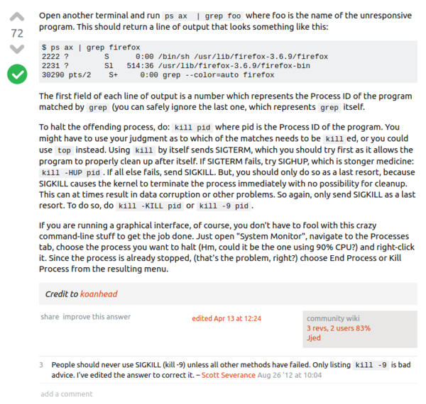

* I was searching on how to have Windows Task Manager functionalities in Linux.
* This solution is usually already built - in by default in Linux.
* First, I need to get the PID numbers (the process ID, I think) of the process I want to terminate. This can be done with `ps ax | grep process_name_here` (for example, `ps ax | grep chromium` to search for Chromium Browser PID).
* Next I can terminate this running process with `kill pid_number_here` (for example, `kill 1234`).
* The `kill` commands process to close. After this command, the mentioned PID process will go on its exit routine. However, if the exit routine took so long, this command can be used instead `kill -KILL pid_number_here`.
* I know this from this link, [https://askubuntu.com/questions/180336/how-to-find-the-process-id-pid-of-a-running-terminal-program](https://askubuntu.com/questions/180336/how-to-find-the-process-id-pid-of-a-running-terminal-program).
* Screenshot.

[./20170706-1352-cet-linux-like-windows-task-manager-2.png](./20170706-1352-cet-linux-like-windows-task-manager-2.png)