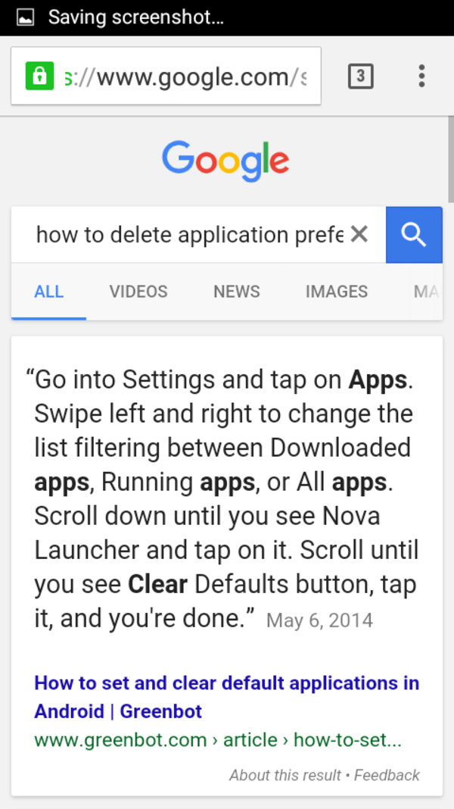
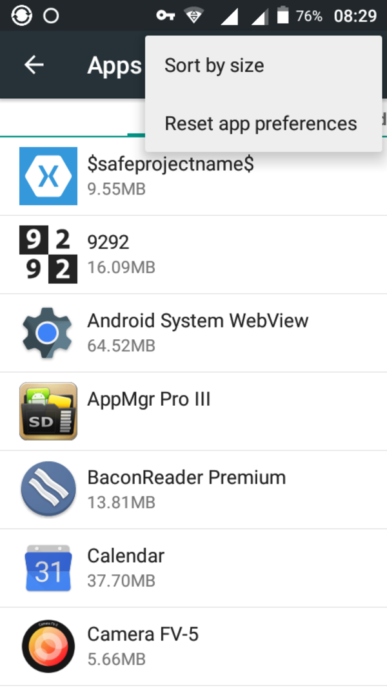

* Here are some screenshots on how to delete applications preference in Android.
* Applications preferences is like when you asked to always open a video file with VLC app or other video player applications.

[./20170712-1447-cet-how-to-delete-application-preferences-in-android-2.png](./20170712-1447-cet-how-to-delete-application-preferences-in-android-2.png)

[./20170712-1447-cet-how-to-delete-application-preferences-in-android-4.png](./20170712-1447-cet-how-to-delete-application-preferences-in-android-4.png)