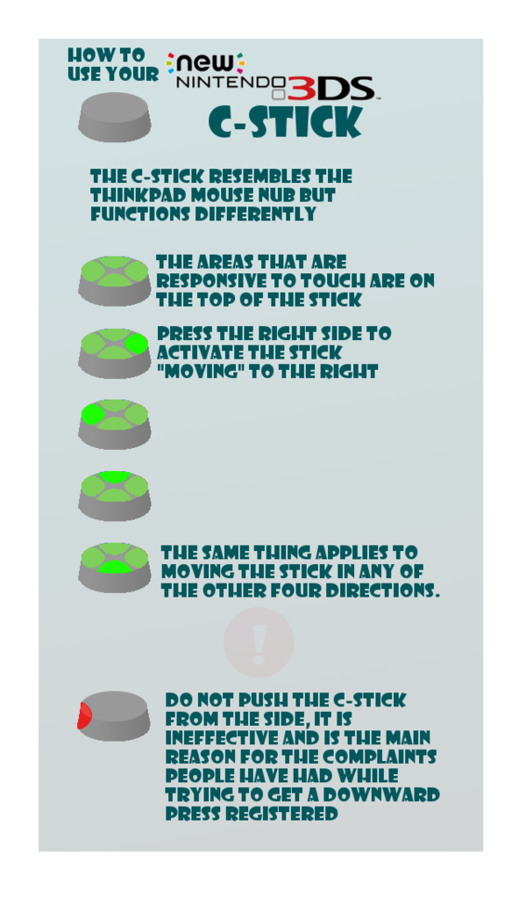

[./20170712-1451-cet-how-to-use-nintendo-new-3ds-c-stick-2.png](./20170712-1451-cet-how-to-use-nintendo-new-3ds-c-stick-2.png)

* The image shown off how to properly use Nintendo New 3DS C - Stick.
* You use the C - Stick actually by pressing it like a D - Pad.
* I thought, by looking at the form, the C - Stick used like a ThinkPad's pointing stick. I was wrong it was not convenient to be used as a pointing stick.