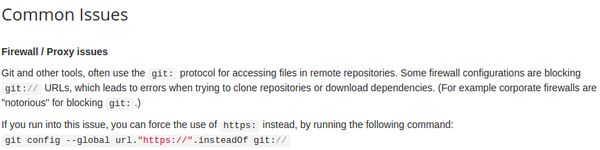

[./20170816-2007-cet-forcing-git-to-use-https-2.png](./20170816-2007-cet-forcing-git-to-use-https-2.png)

* In office network, sometimes the access to git:// is disabled (general Git host service like GitHub will be unavailable).
* The workaround is to enable/force the use of global URL to HTTPS instead to git:// like the image above shown.
* The command is, `git config --global url."https://".insteadOf git://`.